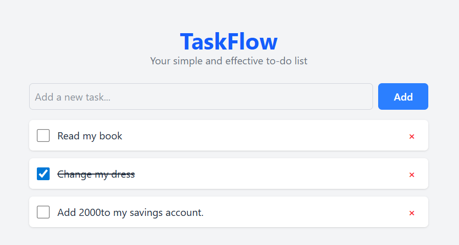

# 📝 TaskFlow - A Modern Frontend Task Manager

TaskFlow is a minimalist, client-side task management application. It's designed for anyone who needs a quick and simple way to organize their daily to-do lists without needing an account or an internet connection after the initial load.

This project matters because it demonstrates a strong command of modern frontend development principles, including component-based architecture, global state management, and local data persistence, all within a serverless application—making it an excellent portfolio piece.


_To add a screenshot: take a picture of your running app and add it to your project folder with the name `screenshot.png`._

---

## ✨ Core Features

- **Add Tasks:** A simple and intuitive form to quickly add new tasks.
- **Mark as Complete:** Toggle the status of any task with a single click. Completed tasks are visually styled with a strikethrough.
- **Delete Tasks:** Easily remove tasks you no longer need.
- **Persistent Storage:** All tasks are automatically saved to your browser's `localStorage`, so your list is always there, even after you close the tab or refresh the page.

---

## 🛠️ Tech Stack

- **Framework:** React (with Vite)
- **Styling:** Tailwind CSS
- **Global State Management:** Zustand
- **Data Persistence:** Browser `localStorage`
- **Testing:** Vitest

---

## 🧠 AI Integration Strategy

My plan is to leverage AI not just for simple code completion, but as a strategic partner in three key areas: feature generation, testing, and documentation, using context-aware techniques to get the best results.

### 1. Code Generation

I will use an in-editor AI agent (GitHub Copilot) to accelerate development by scaffolding the boilerplate for components and data management functions.

- **Component Scaffolding:** I will prompt the AI to generate the basic structure of my React components, such as the `TaskItem` and `TaskForm`.
- **State Management Scaffolding:** I will use the AI to generate the initial structure of my Zustand store, including the state variables and the basic action functions (`addTask`, `deleteTask`, `toggleTask`).

### 2. Testing

To ensure my application's logic is reliable, I will use AI to help generate unit tests for my core state management functions.

- I will provide the AI with a specific function from my Zustand store (e.g., the `toggleTask` action).
- I will then prompt it to generate a complete test suite for that function using Vitest, including the data schema of a task and edge cases like toggling a non-existent task.

### 3. Documentation

I will use AI to ensure my project is well-documented at all levels.

- **Docstrings:** For complex functions, I will ask the AI to generate a JSDoc-style comment block explaining what the function does, its parameters, and what it returns.
- **Inline Comments:** For any non-obvious lines of code, I will use the AI to generate a concise, explanatory comment.
- **README Maintenance:** After the project is complete, I will ask the AI to "proofread and professionalize" this README file.

### 4. Context-Aware Techniques

To get the most accurate and useful results from the AI, I will provide it with specific context.

- **Schema-Aware Generation:** My "schema" will be the shape of my task object, which I will always provide when asking for related code.

  **My Task Schema:**
  ```javascript
  {
    id: number,       // Unique ID (e.g., from Date.now())
    text: string,     // The content of the task
    completed: boolean // The status of the task
  }